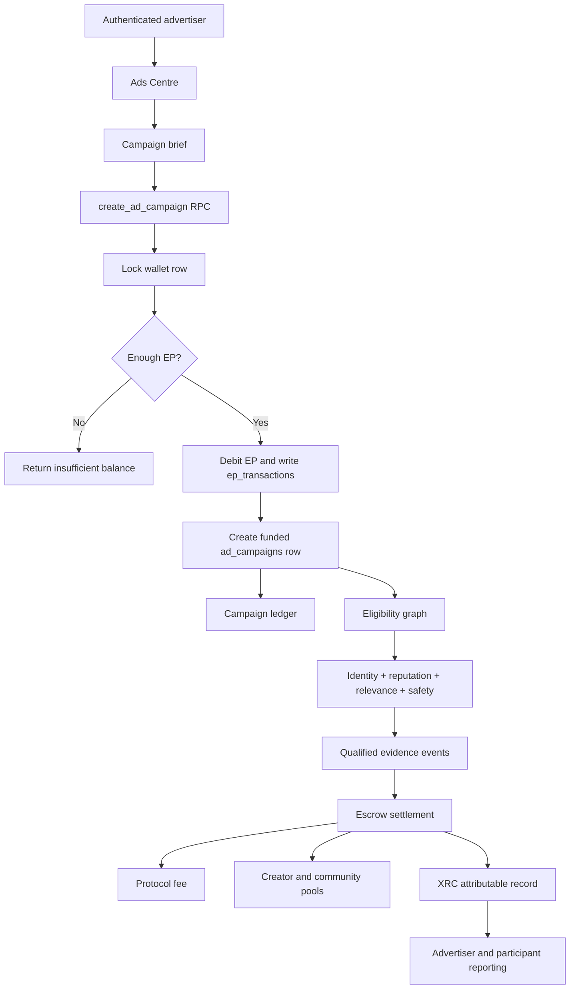

# Xeevia Ads Engine Foundation

## Purpose

The Ads Centre is the product surface for Xeevia's advertising economy. This document records the governing model before campaign delivery or settlement code is built.

## Trust Equation

`Trust = Identity + Economic Cost + Reputation + Behavioral Consistency + Attributable History`

The equation is a system model, not a marketing slogan:

- **Identity**: a participant has a persistent, verifiable account and relationship context.
- **Economic cost**: actions carry a small EP cost that makes mass automated behavior less attractive while preserving normal use.
- **Reputation**: contribution quality and verified participation accumulate over time.
- **Behavioral consistency**: repeated behavior is evaluated for relevance, authenticity, and manipulation patterns.
- **Attributable history**: contribution, outcome, and settlement can be connected to durable XRC evidence.

No single factor is sufficient. EP cost alone is not proof of trust; identity alone is not proof of contribution.

## Product Principle

Xeevia should feel like everyday social life on the surface and like accountable economic infrastructure underneath.

- Reading and ordinary conversation must remain fast and familiar.
- Campaign participation must be explicit and clearly labeled.
- Users must not be exposed to private-message advertising.
- Profile Boost, verification, reputation, and sponsorship must remain separate concepts.
- The platform must never reward volume alone when quality, relevance, or outcome can be measured.

## Campaign Value Model

A campaign creator pool represents 100% of the creator allocation. Qualifying shares resolve proportionally:

```text
Creator share = Creator qualifying value / Total qualifying value * Creator pool
```

The top-contributor rule must not reduce to "who spent the most EP." Qualifying value should combine relevance, original contribution, verified outcome, received engagement quality, reputation, and fraud resistance. Repeated or coordinated actions must have diminishing returns.

## Build Boundary

The current Ads Centre is a read-only control surface. It communicates:

- Campaign and audience readiness.
- The trust model.
- The evidence layer.
- The intended build sequence.

It does **not** yet create campaigns, deliver ads, spend budgets, record impressions, assign creators, or settle EP. Those capabilities require a reviewed schema, permission model, fraud policy, attribution specification, and settlement tests first.

## Engine Sequence

1. **Campaign briefs**: objective, audience, geography, duration, budget, creative, disclosure.
2. **Eligibility graph**: identity, relevance, reputation, location, community fit, safety status.
3. **Evidence stream**: qualified actions, outcomes, attribution windows, fraud signals.
4. **Escrow and settlement**: budget lock, protocol fee, creator/community pool, proportional resolution, XRC record.
5. **Reporting**: advertiser outcome, participant contribution, community benefit, user controls.

## Proof Required Before Scale

Xeevia must compare campaigns against an advertiser's existing channel using:

- Cost per qualified action.
- Conversion and retention.
- Fraud and bot rate.
- Hide/report rate.
- Creator and community payout.
- Attribution completeness.
- Advertiser return.

The architecture is distinctive. Market superiority still has to be demonstrated with live, measured campaigns.

## Engine Graph



The current implementation stops at the funded campaign ledger. Delivery, evidence events, eligibility, and settlement are intentionally separate next stages; no campaign is presented as delivering value until those records exist.
