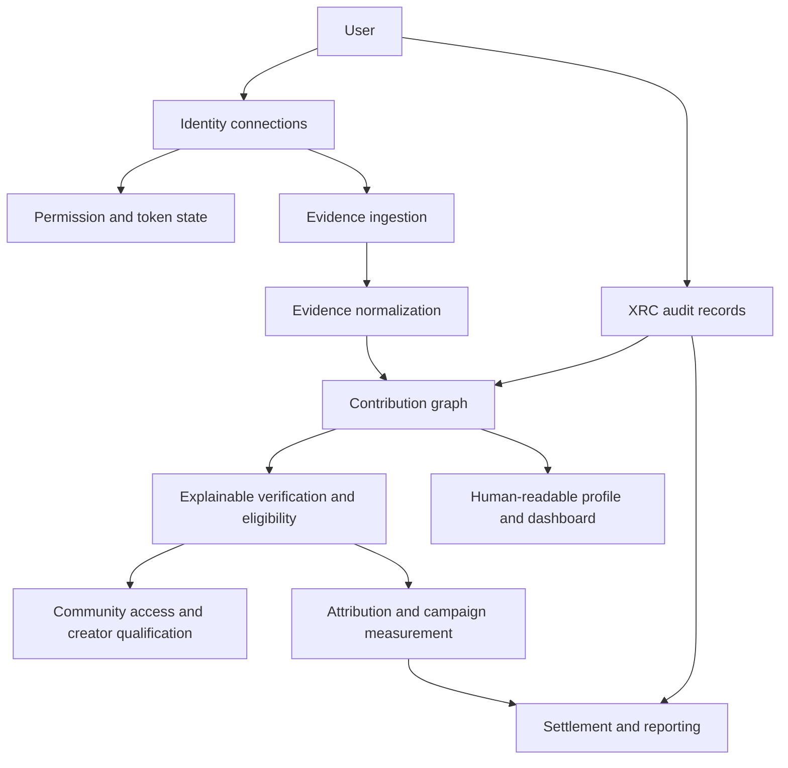

# Xeevia System Architecture

## Overview

Xeevia is organized as a set of connected but separable layers. The separation matters: identity connection, evidence collection, publishing, verification, and economic settlement have different permissions, failure modes, and truth requirements.

## Identity Connections

The connection layer stores a provider, external account identifier, status, connection method, and permission/token relationship. It must distinguish at least:

- Authenticated Xeevia account
- Connected external identity
- Active or revoked connection
- Provider permission scope
- Valid or expired credential
- Profile link supplied by the user
- Token-backed publishing connection
- Evidence-capable connection

A connection is not automatically proof of activity, authorship, or trust.

## Evidence Layer

Evidence items are normalized records with:

- Provider
- Profile and connection references
- Evidence type
- Entity type
- External identifier
- Title and summary
- Source URL where available
- Verification state
- Confidence
- Metadata
- Raw provider payload where retention is permitted
- Created and updated timestamps

Evidence edges link related records, such as a provider profile to activity generated by that profile. This graph is the foundation for explainable claims.

## Connector Classes

Xeevia has two connector classes:

### Native provider connectors

These call a provider API using an appropriate credential and normalize returned profile or activity data. A native connector may claim only the data returned and permitted by that provider.

### Connected-identity connectors

These create an honest identity record when a provider is connected but native activity ingestion is not available. They must not fabricate posts, engagement, followers, or verification. A profile URL is evidence of a supplied link, not automatic proof of ownership or activity.

## Verification and XRC

The evidence graph is intended for human-readable verification and future eligibility decisions. XRC provides a separate audit-oriented record and chain verification mechanism for events that need tamper-evident history.

These concepts must remain distinct:

- Evidence: the underlying source record.
- Verification: the method and confidence applied to that record.
- XRC audit record: an integrity-protected record of an event or state transition.
- Trust decision: a context-specific decision made from evidence and policy.

A hash is not identity proof. A chain is not truth by itself. XRC can show that a recorded event was not changed after recording; it cannot prove that the original external claim was correct without a trustworthy source and collection process.

## Publishing and Distribution

Publishing is intentionally narrower than evidence coverage. A destination may appear in Create only when it has:

1. An active connection.
2. A non-revoked, non-expired publishing credential.
3. A registered adapter.
4. Provider-compatible permissions and content handling.

A platform can contribute identity evidence without being eligible for cross-posting.

## Communities and Access

Community verification should use explicit methods and policies. Quick verification, picture challenges, identity connections, and future evidence-based eligibility are different mechanisms. The product should disclose which method was used and what access it grants.

## Economics and Campaigns

Wallets, EP credits, payments, creator rewards, and advertising are value layers. They should consume evidence and attribution records but must not manufacture trust claims. Campaign delivery, qualification, attribution, and settlement should each have their own durable records and permissions.

## Privacy Boundary

Xeevia should collect the minimum data required for the stated purpose. The architecture must support:

- Scope-aware collection
- Token revocation
- Evidence deletion or suppression where required
- Private versus public evidence policies
- Redaction of raw provider payloads
- No access to private messages or unrelated private data unless an explicit product feature, provider permission, and legal basis exist
